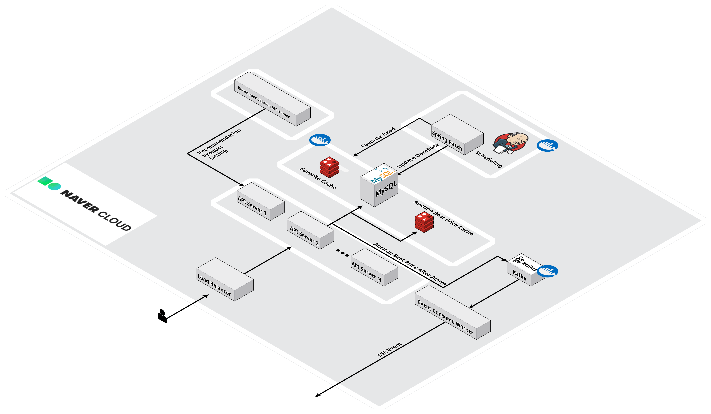

# ready-auction

어떤 물건이든 상관없이 누구나 경매 개설 및 참여할 수 있는 프로젝트입니다.

---

### 시스템 아키텍처

### DB

사진 첨부 예정

### Application UI

### 🎁 경매 상품

🖍️ 판매자/구매자 나누지 않고 모든 사용자는 경매 상품을 등록할 수 있다. 

🖍️ 경매 상품은 상품 이름, 설명, 시작 가격, 상품 이미지, 경매 시작일, 종료일을 가진다. 

🖍️ 경매 상품은 시작, 진행중, 종료 총 3가지의 상태를 가진다.

🖍️ 사용자는 경매 상품을 정렬 또는 필터링을 통해 상품을 조회할 수 있다.

---

### 💵 경매

🖍️ 사용자는 본인이 보유하고 있는 포인트 한도 내에서 입찰을 시도할 수 있으며 입찰 시 포인트를 지불한다. 

🖍️ 입찰이 실패하거나, 더 높은 금액을 제시한 다른 사용자가 나타날 경우, 해당 포인트를 환불받을 수 있습니다.

---

### 🛎️ 최고가 알림

🖍 사용자는 특정 상품을 구독하여 최고가 변경 시 알림을 받을 수 있다. 

---

### 📄 API 문서화

🖍 Spring Rest Docs를 활용하여 API 문서화 

---

### 🏆 추천 기능

🖍️ 사용자들이 경매 상품을 입찰할 때 나이, 성별, 입찰 가격, 입찰 성공 여부를 로깅으로 남긴다. 
🖍️ 해당 데이터를 기반으로 사용자들에게 경매 상품을 추천해준다. 

---

### 개발하면서 들었던 고민/문제 상황 및 해결 방안

(작성 진행중)
