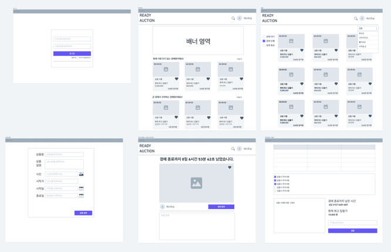

# ready-auction

어떤 물건이든 상관없이 누구나 경매 개설 및 참여할 수 있는 프로젝트입니다.

---

### Application UI

### 🎁 경매 상품

> 🖍️ 판매자/구매자 나누지 않고 모든 사용자는 경매 상품을 등록할 수 있다. 

> 🖍️ 경매 상품은 상품 이름, 설명, 시작 가격, 상품 이미지, 경매 시작일, 종료일을 가진다. 

> 🖍️ 경매 상품은 시작, 진행중, 종료 총 3가지의 상태를 가진다.

> 🖍️ 사용자는 경매 상품을 정렬 또는 필터링을 통해 상품을 조회할 수 있다.

---

### 💵 입찰

> 🖍️ 사용자는 본인이 보유하고 있는 포인트 한도 내에서 입찰을 시도할 수 있으며 입찰 시 포인트를 지불한다. 

> 🖍️ 입찰이 실패하거나, 더 높은 금액을 제시한 다른 사용자가 나타날 경우, 해당 포인트를 환불받을 수 있습니다.

---

### 🛎️ 최고가 알림

> 🖍 사용자는 특정 상품을 구독하여 최고가 변경 시 알림을 받을 수 있다. 

---

### 📄 API 문서화

> 🖍 Spring Rest Docs를 활용하여 API 문서화 

---

### 🏆 추천 기능 (진행중)

> 🖍️ 사용자들이 경매 상품을 입찰할 때 나이, 성별, 입찰 가격, 입찰 성공 여부를 로깅으로 남기고, 해당 데이터를 기반으로 사용자들에게 경매 상품을 추천해준다. 

> 🖍️ 입찰 뿐만 아니라 해당 사용자의 낙찰 정보도 참고하여 상품을 추천한다.

---

### 고민

### ⛔️ 입찰 시 동시성 이슈

#### [문제 상황]

여러 사용자들의 입찰 요청이 같은 시점에 발생하여 트랜잭션이 거의 동시에 진입되면서 가격 유효성 검사를 위해 최고가를 조회 했을 때 해당 트랜잭션 단위에서 최고가 조회값이 같게 나오는 경우 처리하는 순서에 따라서
최고가가 정상적으로 수정되지 않는 동시성 문제가 발생. 

#### [해결 방안]

Redisson Lock 분산락을 사용하여 동시성 문제를 해결

### ⛔️경매 상품 결제할 때 포인트 부족 문제

#### [문제 상황]

사용자들이 보유한 포인트 한도 내에서 여러 경매에 입찰을 시도하고 낙찰을 받으면 상품을 결제할 때 포인트 부족문제가 발생할 수 있다고 생각했습니다.

#### [해결 방안\]

정책적으로 입찰을 시도할 때 포인트를 선지불하고 실패를 하면 다시 돌려받도록 해줌으로써 해결했습니다.

---
작성 진행중

