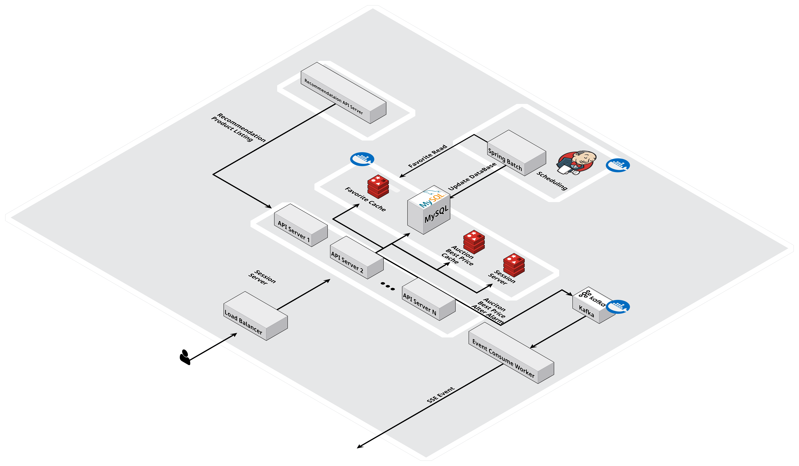
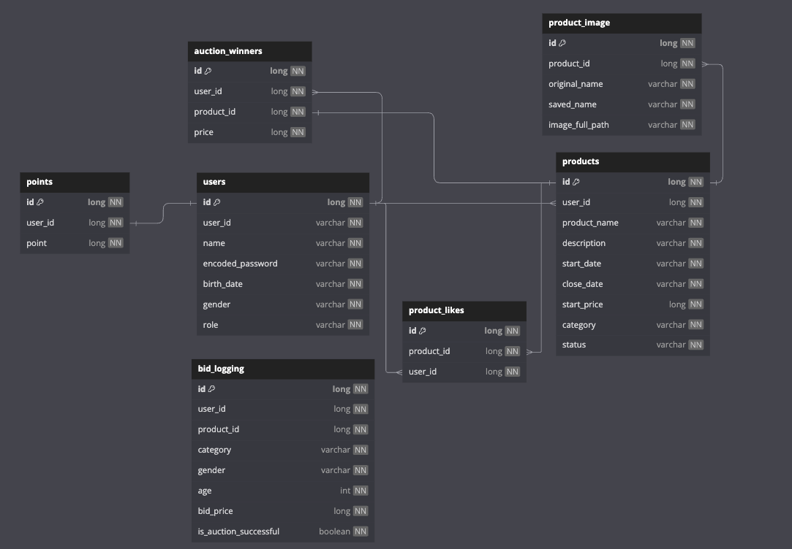

## ready-auction

---

- 복잡한 경매 절차를 대신 수행하여 사용자들의 상품을 경매로 판매할 수 있는 플랫폼을 모티브로 개발한 API 서버 프로젝트입니다.
- Application UI는 whimsical을 통해 대체했으며, 서버 API 개발에 집중

---

### 시스템 아키텍처

### DB

### Application UI

---

### 🎁 경매 상품

- 판매자/구매자 나누지 않고 모든 사용자는 경매 상품을 등록할 수 있다. 
- 경매 상품은 상품 이름, 설명, 시작 가격, 상품 이미지, 경매 시작일, 종료일을 가진다. 
- 경매 상품은 시작, 진행중, 종료 총 3가지의 상태를 가진다.
- 경매 상품 상태가 시작일때만 상품 수정 및 삭제가 가능하다.
- 사용자는 경매 상품을 정렬 또는 필터링을 통해 상품을 조회할 수 있다.

---

### 💵 경매

- 사용자는 본인이 보유하고 있는 포인트 한도 내에서 입찰을 시도할 수 있으며 입찰 시 포인트를 지불한다. 
- 입찰이 실패 or 더 높은 금액을 제시한 다른 사용자가 나타날 경우 포인트를 환불받을 수 있다.

---

### 🏆 추천 기능

- 사용자들이 경매 상품을 입찰할 때 나이, 성별, 입찰 가격, 입찰 성공 여부를 로깅으로 남긴다. 
- 해당 데이터를 기반으로 사용자들에게 경매 상품을 추천해준다. 

---

### 🛎️ 최고가 알림

- 사용자는 특정 상품을 구독하여 최고가 변경 시 알림을 받을 수 있다. 

---

### 📄 API 문서화

- Spring Rest Docs를 활용하여 API 문서화 

---

## 🧐 프로젝트를 진행하며 고민/문제 상황 및 해결 방안

좋아요와 같은 빈번한 작업을 DB에 하는게 맞는가?

#### [문제 상황]

사용자들이 상품에 좋아요를 눌렀을때 기록을 DB에 하는게 맞는가?

#### [해결 방안]

좋아요와 같은 빈번한 작업을 DB에 직접 기록하면 DB에 과부하가 발생할 수 있다고 판단하였습니다. 그래서 Redis에 좋아요 기록을 저장하고, Spring Batch를 이용해 주기적으로 DB에 Bulk
Update를 수행하도록 했습니다.

입찰 시 동시성 이슈

#### [문제 상황]

여러 사용자들이 **동시에 입찰 요청**을 보내는 상황에서, 트랜잭션이 거의 동시에 처리되는 경우,
트랜잭션의 처리 순서에 따라 **최고가**가 정상적으로 업데이트되지 않아 **동시성 문제**가 발생할 수 있습니다.  
즉, **최고가 조회**가 같은 값을 반환하고,
각 트랜잭션이 처리되는 순서에 따라 최고가가 **잘못 갱신**되는 문제가 발생할 수 있습니다.

#### [해결 방안]

**Redisson Lock**을 사용하여 **분산 락**을 적용함으로써 동시성 문제를 해결했습니다. 
분산 락을 적용한 이유는 **클러스터 환경**이라는 점을 생각해서 분산락을 적용하였습니다.

실시간으로 변하는 최고가는 UI에 어떻게 반영해주는가?

#### [문제 상황]

실시간으로 변동하는 최고가를 UI에 어떻게 업데이트를 해줘야하는가?

프로젝트가 경매 시스템이었기 때문에, 최고가 변동을 실시간으로 UI에 반영해야 했습니다. 
이를 위해 실시간 이벤트 처리 기술로 Kafka와 SSE를 선택하여 구현하였습니다.

#### [해결 방안]

**WebSocket vs SSE**

- WebSocket은 양방향 통신이 필요한 경우에 적합하며, 이번 프로젝트에서는 서버 -> 클라이언트 방향의 단방향 통신만 필요했습니다.
  그래서 SSE를 선택했습니다.

**Kafka**

- 경매 시스템에서는 **최고가 변경**과 같은 실시간 이벤트를 처리해야 하므로, 실시간 이벤트 처리를 위해서 **Kafka**를 사용했습니다.

**멀티 모듈 구조**

- 이벤트를 consume하는 모듈이 별도로 존재할 수 있도록 하기위해 프로젝트 구조를 단일 모듈에서 멀티 모듈로 변경했습니다.
- **module-worker 모듈**은 **Kafka 이벤트를 consume**하는 역할을 담당하며, 가격 변동 이벤트를 수신하면 해당 정보를 **SSE**를 통해 **클라이언트**에게 푸시하는 구조입니다.

경매가 종료되었을때, 경매 우승자/경매 종료 관리는 어떻게 해야할까?

#### [문제 상황]

경매가 종료될 때, 해당 경매의 우승자와 **경매 상태(READY, PENDING, DONE)**를 자동으로 변경하는 작업을 어떻게 효율적으로 관리할 수 있을지 고민했습니다.

#### [해결 방안]

**스프링 배치(Spring Batch)** 활용

- 주기적으로 경매 상태를 확인하여 경매 종료 여부를 판단합니다.
- 외부 스케줄러로 Jenkins를 사용하여 주기적으로 작업을 실행합니다.
- 스프링 배치에서 현재 시간과 경매 상품 종료일을 비교하여 경매 상품 상태를 결정합니다.
    - READY: 경매가 아직 시작되지 않은 상태
    - PENDING: 경매가 진행 중이지만 종료되지 않은 상태
    - DONE: 경매가 종료된 상태
- 경매 상태가 종료(DONE) 상태로 변경되면, 해당 상품에 대한 경매가 종료됩니다.
- 해당 상품의 최고가 정보를 조회하고, 경매 우승자 테이블에 우승자와 최고가 정보를 업데이트합니다.

경매 상품을 결제할때 포인트가 부족하면?

#### [문제 상황]

사용자들이 보유한 포인트 한도 내에서 여러 경매에 입찰을 시도하고, 경매에서 낙찰을 받으면 결제 시 포인트 부족 문제가 발생할 수 있습니다.
이로 인해 결제 처리 과정에서 문제가 발생할 수 있다는 생각이 들었습니다.

#### [해결 방안]

정책적으로 입찰 시 포인트를 선지불하는 방식으로 해결했습니다.
이 방식은 사용자가 경매에 입찰할 때 포인트를 미리 차감하고, 입찰 실패 시 차감된 포인트를 환급하는 방식입니다.

추천 서버에 API 요청을 보낼때 장애가 발생하면?

#### [문제 상황]

외부 API 호출 실패 시, 서비스 전체에 영향을 미칠 수 있습니다.
현재 프로젝트에서는 상품 서버가 사용자 나이대와 성별에 따라 추천 상품을 반환하기 위해 추천 서버로 외부 API 요청을 보냅니다.
이때 추천 서버가 다운되거나 응답 속도 저하가 발생하면, 추천 서버와 관련 없는 상품 서버에도 서비스 운영에 차질이 생길 수 있습니다. 이에 대한 해결책이 필요했습니다.

#### [해결 방안]

외부 API 호출에는 **OpenFeign**을 사용했습니다.

1. **Fallback 메서드 적용**:
    - Fallback 메서드를 통해 외부 API 호출에 실패할 경우, 추천 상품 빈 리스트를 반환하도록 설정했습니다.
    - 이를 통해 추천 서버의 상태와 관계없이 상품 서버는 정상적으로 동작하고, 서비스 운영에 차질이 없도록 했습니다.
2. **Circuit Breaker 패턴 적용**:
    - Circuit Breaker를 적용하여 외부 API 장애가 지속될 경우, 일정 시간 동안 API 호출을 차단합니다.
    - 이를 통해 장애가 지속되는 상황에서 다른 시스템에 미치는 영향을 최소화할 수 있도록
      하였습니다.

상품 조회 API 성능 문제

#### [문제 상황]

상품 조회 관련 일부 API의 성능 테스트를 진행한 결과, 
테스트 데이터로 DB에 상품 데이터 등 60만건 정도 넣고 성능 테스트를 진행해보았습니다.
**상품 최신순 조회 API**에서 `평균 응답속도 50~55초` 라는 성능 문제가 발생했습니다.  
심지어 가상 유저 20명 외에는 정상적으로 통과하지 못하는 상황이었습니다.

#### [해결 방안]

성능 문제를 파악하기 위해 **Prometheus**와 **Grafana**로 모니터링을 진행했으나,
특별한 문제를 발견할 수 없었습니다. 

그 후 DB 모니터링을 추가하여 MySQL Exporter를 설정, slow query를 1초 이상으로 설정하고 모니터링한 결과, 3초 이상 소요되는 slow query가 다수 존재하는 것을 확인했습니다.
 특히, 상품 이미지 테이블에서 상품 이미지를 조회하는 쿼리에서 3초 이상 걸리는 쿼리가 많았습니다.

`EXPLAIN`을 통한 쿼리 분석을 통해 해당 쿼리에서 상품 ID에 인덱스가 없음을 발견하고, 상품 이미지 테이블에서 상품 ID 컬럼에 인덱스를 추가했습니다.
그 결과, 상품 최신순 조회 API의 성능이 크게 개선되어,  
가상 유저 100명 기준 `평균 응답속도는 300ms로 단축`되었습니다.

성능을 더욱 최적화하기 위해, **서버 인스턴스 2개와 Load Balancer**를 도입하여 **성능 테스트**를 진행했습니다.  
이후 테스트 결과, 평균 응답속도가 **280ms**로 추가적으로 개선되었습니다. 또한, 각 서버 인스턴스의 모니터링을 통해 CPU 사용량은 50%로 균등하게 분배되어 API 요청 분배가 제대로 이루어졌음을 확인할
수
있었습니다.

세션 관리는 어떻게 할 것인가?

#### [문제 상황]

클러스터링 환경에서는 로드 밸런서를 맨 앞에 배치하고, 그 뒤에 여러 대의 서버 인스턴스를 배포하는 구조를 사용합니다.
이때, 요청이 각기 다른 서버로 분배되면서 세션 불일치 문제가 발생할 수 있습니다.
즉, 클라이언트가 특정 서버에 연결된 상태에서 세션 정보가 다른 서버와 공유되지 않으면, 다음 요청 시 세션 정보를 찾을 수 없게 되어 문제를 일으킬 수 있습니다.

#### [해결 방안]

세션 관리 방식으로는 Sticky Session, Session Clustering, 세션 스토리지 분리 방식이 있습니다.
그 중 세션 스토리지를 분리하는 방식을 선택하였으며, 외부 저장소로는 Redis를 사용했습니.

